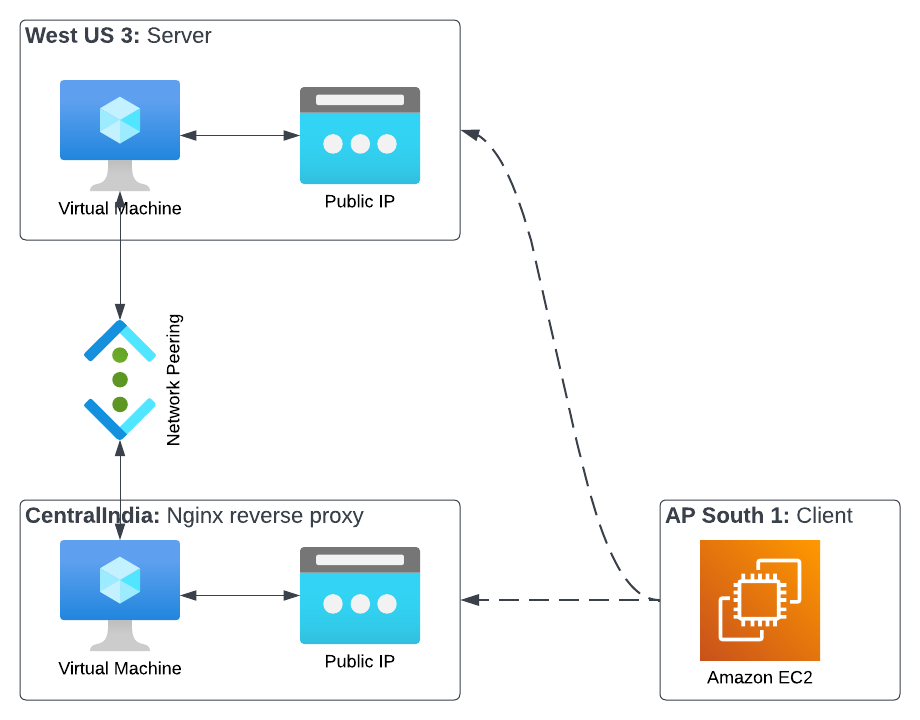

# CloudRegionSpanning
### Summary
For a multi-region deployment in Azure does how much does [virtual network peering](https://learn.microsoft.com/en-us/azure/virtual-network/virtual-network-peering-overview) improve network latency?  Specifically we have a web-based application that has users both in the US and in India.  The latency experienced by the Indian users has greatly impeded the usability of the application. 

This repository contains Terraform files to build a test architecture on Azure and AWS consisting of three virtual machines:
1. `nginx` server in a US region
2. `nginx` non-caching reverse proxy server in a central Indian region
3. client/test machine on AWS

A large random file is created on the server vm.  This file is downloaded repeatedly by the client in order to calculate average network speeds.  The client repeats this test twice, downloading from the sever directly, then again through the proxy.

### Results
